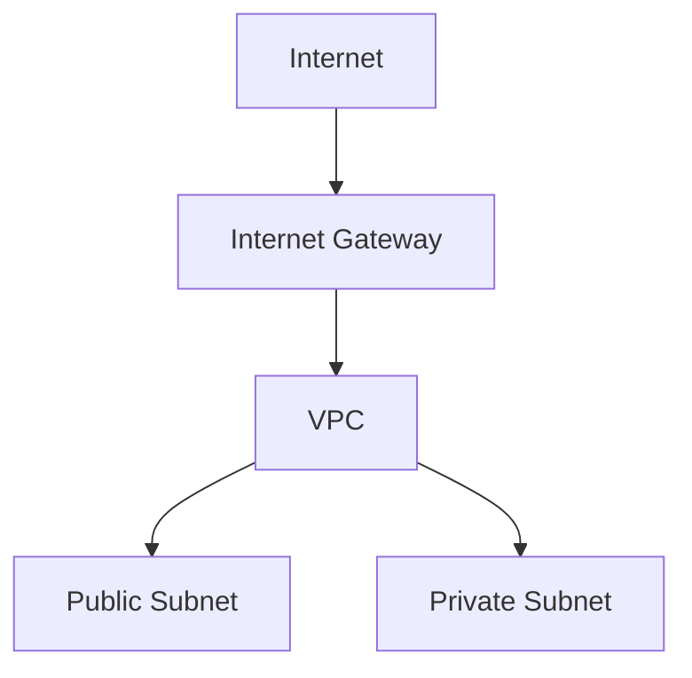
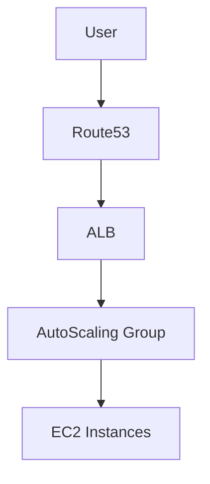
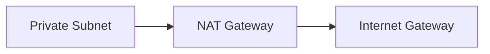
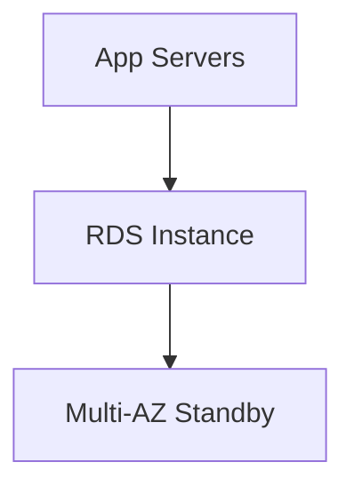
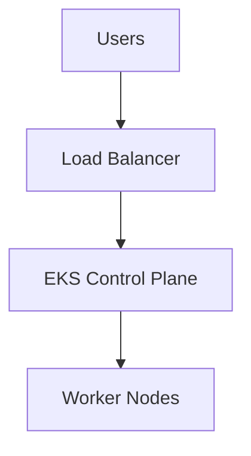

# 🏗️ AWS Architecture Diagrams

## VPC Overview

```mermaid
flowchart TD
    A[Internet] --> B[Internet Gateway]
    B --> C[VPC]
    C --> D[Public Subnet]
    C --> E[Private Subnet]
```

## EC2 + ALB

```mermaid
flowchart TB
    A[User] --> B[Route53]
    B --> C[ALB]
    C --> D[AutoScaling Group]
    D --> E[EC2 Instances]
```

## NAT Gateway + Private Subnets

```mermaid
flowchart LR
    A[Private Subnet] --> B[NAT Gateway]
    B --> C[Internet Gateway]
```

## RDS Database

```mermaid
flowchart TD
    A[App Servers] --> B[RDS Instance]
    B --> C[Multi-AZ Standby]
```

## EKS Cluster

```mermaid
flowchart TD
    A[Users] --> B[Load Balancer]
    B --> C[EKS Control Plane]
    C --> D[Worker Nodes]
```
