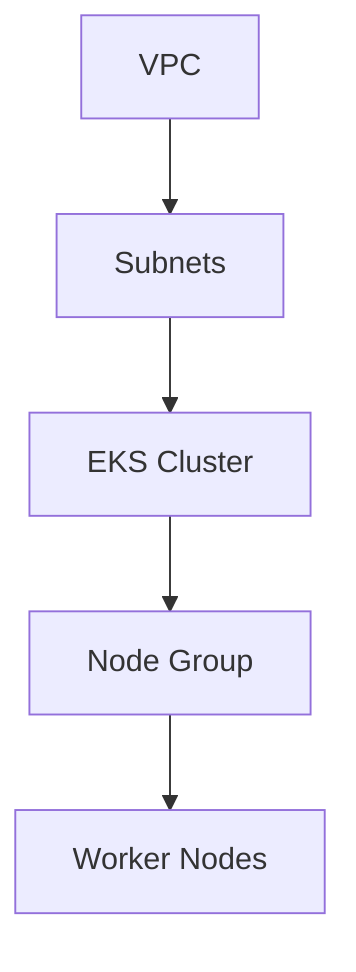

# EKS End-to-End Terraform Example
## Diagram

```mermaid
flowchart TD
  A[VPC] --> B[Subnets]
  B --> C[EKS Cluster]
  C --> D[Node Group]
  D --> E[Worker Nodes]
```

This example deploys:
- VPC
- Public/private subnets
- EKS Cluster
- Managed Node Group
