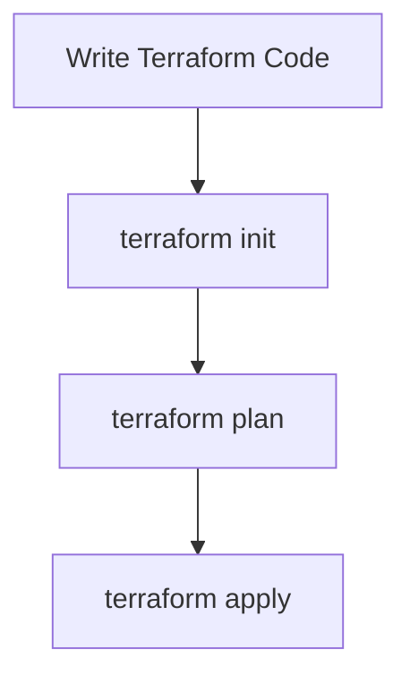

# Lesson 01 — Introduction to Terraform
## Diagram

```mermaid
flowchart TD
  A[Write Terraform Code] --> B[terraform init]
  B --> C[terraform plan]
  C --> D[terraform apply]
```
## Overview
Terraform is Infrastructure-as-Code...
